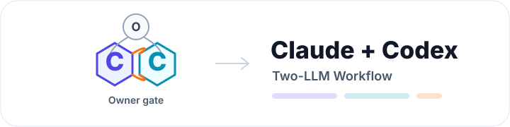
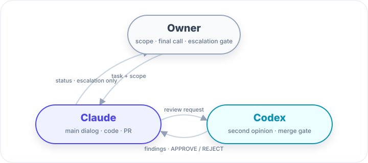
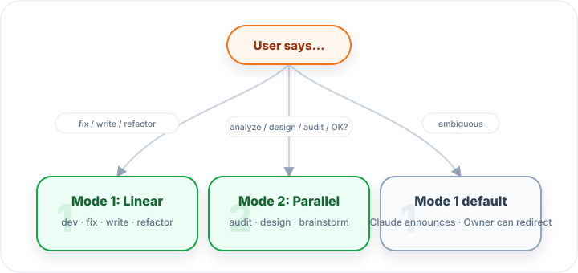
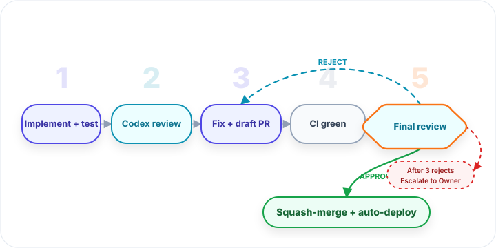
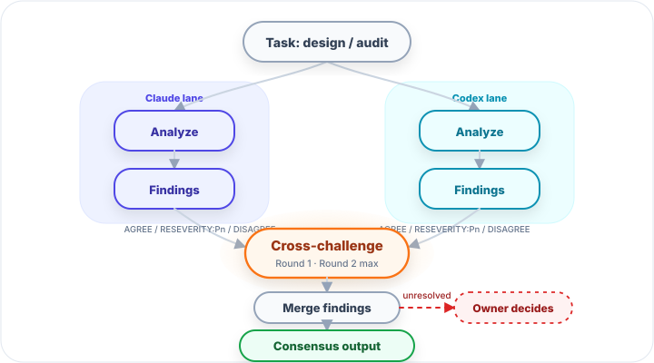

# Claude + Codex Collaboration Workflow

> English version · [中文版本](README.zh.md)

<p align="center">
  
</p>

Two LLMs cross-check; you only step in for the calls that matter.

> Two-LLM development collaboration protocol. Claude leads the dialog and writes code; Codex serves as the independent second opinion and merge gate; the Owner only intervenes on escalation.

<p align="center">
  
</p>

---

## What this protocol solves

A solo LLM writing code is like writing without review: fast, but the blind spots ship along with the diff. Asking the Owner to review every line creates a bottleneck — either the team slows down, or the Owner ends up trusting reasoning that was never independently challenged.

This protocol splits the work between two LLMs. Claude leads the dialog, writes code, runs tests, and drives the PR forward. Codex acts as an independent second opinion and the merge gate. The Owner stops doing line-by-line review and only steps in for conflicts, prod-critical changes, or repeated REJECTs.

Two fixed flows: a 5-phase Linear flow (dev / fix) and a Parallel Analyst flow (design / audit). Combined with prod-critical guardrails and an escalation path, it turns "let another model take a look" into a repeatable, traceable engineering process.

Tested on a real P0 fix: 17 audit findings settled through two rounds of independent analysis; Phase 2 surfaced 6 follow-ups; Phase 5 APPROVE on the first round shipped directly to prod with zero rework.

---

## Mode picking (announce-and-route)

Claude announces which mode to use the moment a trigger word appears in the task; the Owner can override with one sentence.

<p align="center">
  
</p>

---

## Mode 1 — Linear 5-phase (dev / fix / known-target)

<p align="center">
  
</p>

| Phase | Actor | Output |
|---|---|---|
| 1 | Claude | Implementation + unit tests + local full test suite |
| 2 | Codex | Pre-PR review, finding table + PASS / NEEDS_FIXES / BLOCK |
| 3 | Claude | Accept / reject / defer findings + open draft PR |
| 4 | Claude | Push + wait for CI green |
| 5 | Codex | Final review, single-token APPROVE / REJECT |
| Merge | Claude | After APPROVE: squash-merge + delete branch + CI auto-deploys |

**Escalation path**: Phase 5 REJECT escalation is finding-cost-aware — on the 3rd REJECT, estimate the fix size: < 10 min (typically hygiene / log-level / typo) you continue to round 4 on your own; ≥ 10 min or design-tradeoff territory, escalate to Owner; any 5th REJECT forces escalation. See [runbook §Mode 1](runbook.md) for the full ladder.

---

## Mode 2 — Parallel Analyst (design / audit / brainstorm)

<p align="center">
  
</p>

```
Step 1  Both sides analyze independently (Codex in background, Claude in foreground)
Step 2  Cross-challenge: each finding tagged AGREE / AGREE_BUT_RESEVERITY:Pn / DISAGREE + one-line reason
Step 3  Merge and dedupe; drop findings both sides agree are misreads; escalate unresolved disagreements to the Owner
```

**Round cap: 2**. Beyond that, marginal returns drop sharply. Mode 2 doesn't open a PR — switch to Mode 1 to actually fix.

---

## What it costs / what you get

| What you give up | What you get |
|---|---|
| Codex CLI subscription / API tokens | Bugs caught by an independent LLM before they reach prod |
| ~10-30 min per PR of workflow overhead | Small PRs get a calm second look, big PRs get an extra merge gate |
| CLI install + prompt template learning curve | Every PR leaves an audit trail (finding / verdict / CI / commits) — afterwards you can trace who approved what and why |
| Some token waste (redundant review / false flags) | Owner steps back from line-by-line review to "watch escalations + 30-min observation" |
| Two LLMs occasionally disagree | Real-world example: a P0 fix where Codex Phase 2 surfaced 6 follow-ups, Phase 5 APPROVE shipped to prod first try |

---

## Where this fits

Anywhere "an independent second model takes another look" reduces risk or saves Owner attention is a candidate. Concrete cases:

- **Solo dev / small teams / open-source maintainers**: no senior colleague available for review. Codex covers Phase 2 / Phase 5; Owner drops from line-by-line review to "watch escalations". The review SLA stops bottlenecking on one person.
- **Money / compliance / security code paths**: money or sensitive data on the line; one bad commit costs money or trips regulators. Every change gets an independent second opinion; prod-critical paths still escalate to Owner. Typical examples: payment integrations, auth / crypto implementations, healthcare compliance systems, billing / permissions / user-data pipelines.
- **Large refactors / framework upgrades / DB migrations**: diff spans many modules; corner cases slip past a single LLM. Mode 1 forces two rounds of independent review (Phase 2 detail + Phase 5 holistic) — beats "one careful read".
- **Pre-launch audits / architecture decisions / system design reviews**: Mode 2 parallel analyst has Claude and Codex produce independent analyses, then cross-challenge — a real audit on a critical code path produced 17 findings (3 P0 / 11 P1 / 3 P2) this way.
- **Reviewing code written by another LLM**: have Codex review what Claude wrote (or vice versa) — higher chance of catching blind spots than a single LLM self-reviewing.
- **Protocol / spec / load-bearing docs**: this protocol's own README + runbook are also edited through the workflow — mistakes here propagate to every adopter, so the docs-only exemption doesn't apply (see the "When not to use" exception clause below).

Doesn't fit → see "When not to use this" below.

---

## Quick Start (5 min)

```bash
# 1. Install Codex CLI + login
npm install -g @openai/codex
codex login    # ChatGPT subscription or API key both work
codex exec "hello"   # verify

# 2. Install GitHub CLI + auth
brew install gh
gh auth login

# 3. Make sure your project has a CI workflow (anything that runs tests on PR)

# 4. Drop runbook.md into your project
#    Or paste it at the start of a fresh Claude session
```

After those 4 steps, your next low-risk task is ready to ride the workflow.

First run should be a **low-risk task** (a small bug fix or doc typo) to validate the chain end-to-end, then graduate to higher-risk work.

---

## Full specification

Detailed protocol, prompt templates, real-world pitfalls, prod-critical blacklist:

→ **[runbook.md](runbook.md)**

---

## When *not* to use this

- A 1-line typo / log message — just commit
- Time-critical incident hotfix — go manual fast path, audit afterward
- Owner has 100% confidence + the diff is tiny — workflow has token cost
- Docs-only changes — Phase 2/5 add no value

**Exception (must run the full workflow)**: changes to this protocol's own README / runbook. These are the entry point others adopt the workflow from; the "docs-only" exemption doesn't apply because a mistake here propagates to every adopter.

---

## Feedback

If you hit a new pitfall or want to suggest a protocol change, edit the "Pitfalls" / "Evolution" sections of [runbook.md](runbook.md) and open a PR.
