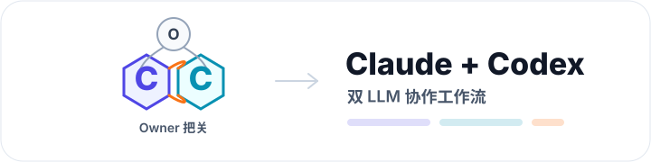
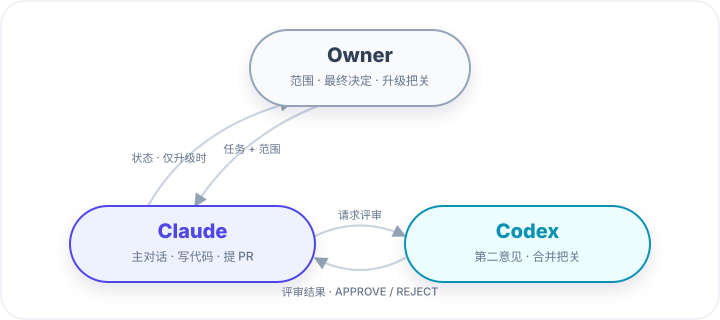
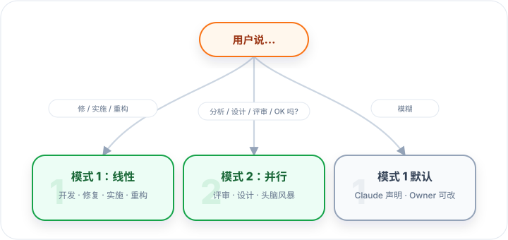
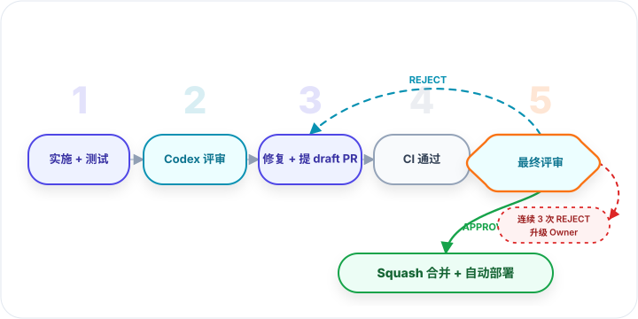
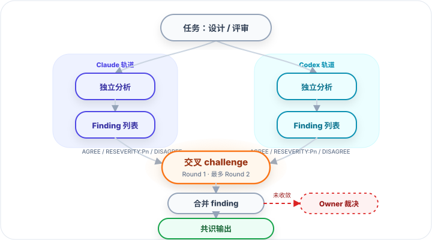

# Claude + Codex 协作工作流

> 中文版本 · [English version](README.md)

<p align="center">
  
</p>

两个 LLM 互相 review；只在真正需要决断的时候找你。

> 双 LLM 开发协作 protocol。Claude 主对话写代码，Codex 当独立第二意见和合并把关，Owner 只在升级时介入。

<p align="center">
  
</p>

---

## 这套解决什么

单 LLM 写代码就像没人 review：速度快，但盲点也跟着进 diff。Owner 全审又会变成瓶颈，最后要么拖慢节奏，要么被迫相信一段没被独立挑战过的 reasoning。

这套 protocol 把 Claude 和 Codex 分成两个角色：Claude 主对话写代码、跑测试、推进 PR；Codex 做独立第二意见和合并把关。Owner 不再逐行审，只在冲突、prod-critical、连续 REJECT 时才出手。

固定流程只有两条：5 阶段线性流程（开发 / 修复）和并行 analyst（设计 / 评审）。再加 prod-critical 护栏和升级路径，就把"另一个模型再看一眼"做成了可重复、可追踪的工程流程。

实际跑过一次 P0 修复：17 条 audit finding 通过两轮独立分析定下来；Phase 2 又抓出 6 条 follow-up；Phase 5 第 1 轮 APPROVE，直接 ship 到 prod，0 返工。

---

## 模式选择（开口就分流）

Claude 在任务入口听到 trigger 词就显式声明走哪种流程，Owner 一句话能否决重选。

<p align="center">
  
</p>

---

## 模式 1：线性 5 阶段（开发 / 修复 / 目标明确）

<p align="center">
  
</p>

| 阶段 | 角色 | 输出 |
|---|---|---|
| 1 | Claude | 实施 + 单元测试 + 本地全套测试 |
| 2 | Codex | pre-PR 评审，finding 表 + PASS / NEEDS_FIXES / BLOCK |
| 3 | Claude | accept / reject / defer 处理 + 提 draft PR |
| 4 | Claude | push + 等 CI 通过 |
| 5 | Codex | final 评审，单 token APPROVE / REJECT |
| 合并 | Claude | APPROVE 后 squash 合并 + 删分支 + CI 自动部署 |

**升级路径**：第 5 阶段连续 3 轮 REJECT → 升级 Owner 决定。

---

## 模式 2：并行 Analyst（设计 / 评审 / 头脑风暴）

<p align="center">
  
</p>

```
Step 1  双方独立分析（Codex 跑 background，Claude 跑 foreground）
Step 2  交叉 challenge：每条 finding 标 AGREE / AGREE_BUT_RESEVERITY:Pn / DISAGREE + 一句理由
Step 3  合并去重，drop 双方共识的误报，无法收敛的升级 Owner
```

**Round 上限 2 轮**。再多边际收益骤降。模式 2 不出 PR — 要修就转模式 1。

---

## 你付出 / 你得到

| 你付出 | 你得到 |
|---|---|
| Codex CLI 订阅 / API tokens | Bug 进 prod 前被独立 LLM 抓掉一轮 |
| 每个 PR 多 ~10-30 分钟 workflow overhead | 小 PR 多一次冷静复核，大 PR 多一道合并把关 |
| CLI 安装 + prompt 模板的学习成本 | 每个 PR 留下 finding / verdict / CI / commits，事后能追到谁为什么放行 |
| 一些 token 浪费（重复评审 / 误判） | Owner 从逐行 review 退到只看升级 + 30 分钟监控 |
| 两个 LLM 偶尔互相 disagree | 实测一次 P0 修复：Codex Phase 2 抓出 6 条 follow-up，Phase 5 APPROVE 后直接 ship |

---

## 适合的场景

只要"另一个独立模型再看一眼"能降低风险或减少 Owner 工作量，就值得跑这套。具体几类：

- **单人 / 小团队 / 开源 maintainer**：找不到 senior 同事二审。Codex 顶上 Phase 2 / Phase 5 两个把关，Owner 从"逐行批注"退到"看升级"。Review SLA 不再卡在一个人身上。
- **资金 / 合规 / 安全相关代码**：钱或敏感数据在线，单笔错就亏钱或踩监管。每个改动都有独立第二意见，prod-critical 路径再升级 Owner 二次确认。典型场景：支付接入、auth / crypto 实现、医疗合规系统、计费 / 权限 / 用户数据处理。
- **大 refactor / 框架升级 / 数据库 migration**：diff 跨多个 module，corner case 容易漏。Mode 1 强制两轮独立评审（Phase 2 detail + Phase 5 整体），比"自己看一遍"靠谱。
- **预发布 audit / 架构选型 / 系统设计 review**：Mode 2 并行 analyst 让 Claude 和 Codex 各出独立分析再 cross-challenge — 实测一次核心代码路径 audit 出 17 条 finding（3 P0 / 11 P1 / 3 P2）就是这么跑的。
- **review 另一个 LLM 写的代码**：让 Codex 看 Claude 写的（或反过来），比单 LLM 自我 review 更容易抓出盲点。
- **协议 / 规范 / load-bearing 文档**：本 protocol 自己的 README + runbook 也通过这套流程改 — 错在这里会扩散到所有 adopter，所以 docs-only 豁免对它们不适用（详见下面"什么时候不用"的例外条款）。

不适合的场景见下面"什么时候不用"。

---

## Quick Start（5 分钟）

```bash
# 1. 安装 Codex CLI 并登录
npm install -g @openai/codex
codex login    # ChatGPT 或 API key 都行
codex exec "hello"   # 验通

# 2. 安装 GitHub CLI 并 auth
brew install gh
gh auth login

# 3. 项目里要有 CI workflow（任何能在 PR 上跑测试的都行）

# 4. 把 runbook.md 放进项目
#    或在新会话开头粘给 Claude
```

跑通这 4 步以后，下一个低风险 task 就可以挂上 workflow 了。

第一次跑用一个**低风险 task**（小 bug 修复 / 文档 typo）验证整链通，再放更高风险的进来。

---

## 完整规范

详细 protocol、prompt 模板、踩坑列表、prod-critical 黑名单：

→ **[runbook.md](runbook.md)**

---

## 什么时候*不*用

- 1 行 typo / log message — 直接 commit
- 时间紧急的 incident hotfix — 走 manual fast path，事后再 audit
- Owner 100% 信心 + diff 极小 — workflow 有 token 成本
- 文档 only 改动 — Phase 2/5 无价值

**例外（必须走完整流程）**：本 protocol 自身的 README / runbook 改动。它们是其他人采用这套工作流的入口，"文档 only" 豁免不适用 — 一旦在这里出错，错误会扩散到所有 adopter。

---

## 反馈

踩到新坑 / 觉得 protocol 该调整 → 改 [runbook.md](runbook.md) 的"踩过的坑" / "演进规则"章节，提 PR。
